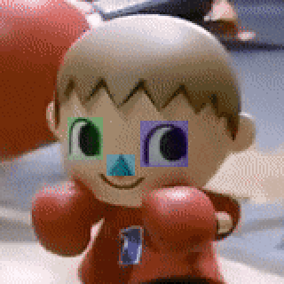
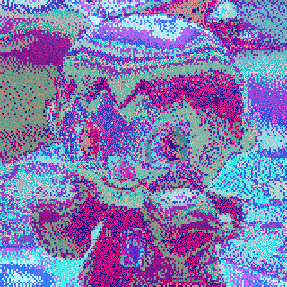
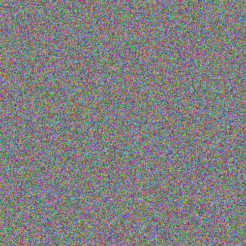

# `imgutils` - random image manipulation tools

## Requirements

* Rust

## Make the tool

```bash
cargo r
```

## Installing (Linux only atm)

¯\_(ツ)_/¯


## Results

### Cursed

| Original                         | New                                     |
| -------------------------------- | --------------------------------------- |
|  |  |

### Random 

| 500x500                               | 1000x1000                                |
| ------------------------------------- | ---------------------------------------- |
|  |  |